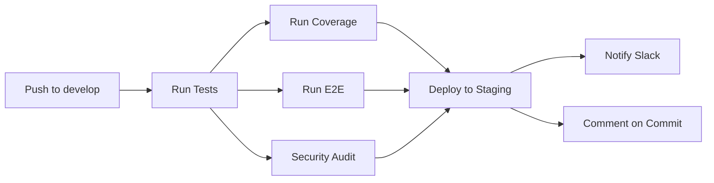

# GitHub Actions Workflows

This directory contains CI/CD workflows for the Tauze ERP v5.0 project.

## Workflows

### CI Pipeline (`ci.yml`)

**Trigger:**
- Push to any branch
- Pull requests to any branch

**Jobs:**

#### 1. Test & Build
- Checkout code
- Setup Node.js 20
- Install dependencies
- Run linting checks
- Run type checking
- Run format checking
- Run tests with coverage
- Build application
- Upload artifacts (coverage, build)

#### 2. Coverage
- Run test coverage
- Upload to Codecov
- Comment PR with coverage report

#### 3. E2E Tests
- Install Playwright browsers
- Run end-to-end tests
- Upload test results and videos on failure

#### 4. Security Audit
- Run `npm audit` for vulnerabilities
- Check for hardcoded secrets with TruffleHog

#### 5. Deploy to Staging ⭐ NEW
**Trigger:** Push to `develop` branch only  
**Depends on:** All previous jobs must pass

**Steps:**
- Build with staging environment variables
- **Create Sentry release and upload source maps** ⭐ NEW
- Deploy to Vercel staging environment
- Send Slack notification (success/failure)
- Add GitHub commit comment with deployment status

**Requirements:** 13.3, 13.6

#### 6. Deploy to Production
**Trigger:** Push to `main` branch only  
**Depends on:** All previous jobs must pass

**Steps:**
- Build with production environment variables
- **Create Sentry release and upload source maps** ⭐ NEW
- Deploy to production hosting platform
- Notify deployment success or failure

**Requirements:** 13.4

---

## Secrets Configuration

### Required for CI

| Secret | Description | Required For |
|--------|-------------|--------------|
| `VITE_SUPABASE_URL` | Production Supabase URL | Build step |
| `VITE_SUPABASE_ANON_KEY` | Production Supabase key | Build step |
| `CODECOV_TOKEN` | Codecov upload token | Coverage reporting |

### Required for Staging Deployment

| Secret | Description | How to Obtain |
|--------|-------------|---------------|
| `VERCEL_TOKEN` | Vercel auth token | [Vercel Dashboard](https://vercel.com/account/tokens) |
| `VERCEL_ORG_ID` | Vercel organization ID | Run `vercel link` → `.vercel/project.json` |
| `VERCEL_PROJECT_ID` | Vercel project ID | Run `vercel link` → `.vercel/project.json` |
| `STAGING_SUPABASE_URL` | Staging Supabase URL | Staging Supabase dashboard |
| `STAGING_SUPABASE_ANON_KEY` | Staging Supabase key | Staging Supabase dashboard |
| `STAGING_STRIPE_PUBLISHABLE_KEY` | Stripe test key | [Stripe Dashboard](https://dashboard.stripe.com/test/apikeys) |
| `STAGING_SENTRY_DSN` | Staging Sentry DSN | Staging Sentry project |
| `STAGING_POSTHOG_KEY` | Staging PostHog key | Staging PostHog project |
| `STAGING_POSTHOG_HOST` | PostHog host URL | Usually `https://app.posthog.com` |
| `SLACK_WEBHOOK_URL` | Slack webhook for notifications | [Slack Incoming Webhooks](https://api.slack.com/messaging/webhooks) |

### Required for Sentry Release Tracking ⭐ NEW

| Secret | Description | How to Obtain |
|--------|-------------|---------------|
| `VITE_SENTRY_AUTH_TOKEN` | Sentry auth token for uploads | [Sentry Dashboard](https://sentry.io/) → Settings → Account → API → Auth Tokens |
| `SENTRY_ORG` | Sentry organization slug | Sentry Dashboard → Settings → General → Organization Slug |
| `SENTRY_PROJECT` | Sentry project slug | Sentry Project → Settings → General → Project Slug |

**Note:** See [`/docs/SENTRY_SECRETS_SETUP_CHECKLIST.md`](../../docs/SENTRY_SECRETS_SETUP_CHECKLIST.md) for detailed setup instructions.

### Setup Instructions

```bash
# Using GitHub CLI
gh secret set SECRET_NAME

# List all secrets
gh secret list

# Delete a secret
gh secret delete SECRET_NAME
```

Or via GitHub UI:
1. Repository → Settings
2. Secrets and variables → Actions
3. New repository secret

---

## Environments

### staging
- **URL:** https://staging.tauze.app
- **Branch:** `develop`
- **Auto-deploy:** ✅ On push to develop
- **Protection rules:** 
  - Deployment branches: `develop` only

### production (coming soon)
- **URL:** https://app.tauze.app
- **Branch:** `main`
- **Auto-deploy:** 🔜 Task 29.2
- **Protection rules:**
  - Required reviewers
  - Deployment branches: `main` only

---

## Deployment Flow

### Staging Deployment


### Workflow
1. Developer pushes to `develop` branch
2. CI runs all quality checks (lint, test, e2e, security)
3. If all checks pass, deploy to staging
4. Slack notification sent to team
5. GitHub commit comment added with deployment URL

---

## Monitoring & Debugging

### View Workflow Runs
```bash
# List recent runs
gh run list --workflow=ci.yml

# View specific run
gh run view RUN_ID --log

# Watch a run in progress
gh run watch
```

### Cancel a Run
```bash
gh run cancel RUN_ID
```

### Re-run Failed Jobs
```bash
gh run rerun RUN_ID
```

### Manual Trigger
```bash
# Trigger on specific branch
gh workflow run ci.yml --ref develop
```

---

## Troubleshooting

### Deployment Fails with "Unauthorized"

**Cause:** Invalid `VERCEL_TOKEN`

**Fix:**
1. Generate new token at https://vercel.com/account/tokens
2. Update GitHub secret: `gh secret set VERCEL_TOKEN`

### Build Fails with Missing Environment Variables

**Cause:** Staging secrets not configured

**Fix:**
1. Check secrets: `gh secret list`
2. Add missing secrets: `gh secret set STAGING_SUPABASE_URL`

### Slack Notifications Not Working

**Cause:** Invalid `SLACK_WEBHOOK_URL`

**Fix:**
1. Test webhook:
   ```bash
   curl -X POST -H 'Content-type: application/json' \
     --data '{"text":"Test"}' YOUR_WEBHOOK_URL
   ```
2. If test fails, recreate webhook in Slack
3. Update secret: `gh secret set SLACK_WEBHOOK_URL`

### Deployment Skipped

**Cause:** Not on `develop` branch or prerequisite jobs failed

**Fix:**
1. Verify branch: `git branch --show-current`
2. Check job logs for failures
3. Fix failing tests/checks and push again

---

## Performance

### Caching Strategy
- Node modules cached using `actions/setup-node@v4` with `cache: 'npm'`
- Playwright browsers cached automatically
- Vercel build cache managed by Vercel

### Optimization Tips
1. Use `npm ci` instead of `npm install` (faster, deterministic)
2. Run jobs in parallel when possible (test, coverage, e2e, security)
3. Upload artifacts only when needed (coverage, failed e2e tests)

---

## Security

### Best Practices
1. ✅ Never commit secrets to repository
2. ✅ Use separate credentials for staging and production
3. ✅ Rotate secrets every 90 days
4. ✅ Limit secret access to necessary jobs only
5. ✅ Monitor workflow runs for suspicious activity

### Secret Rotation Checklist
- [ ] Vercel token
- [ ] Supabase keys (staging & production)
- [ ] Stripe keys
- [ ] Sentry DSN
- [ ] PostHog keys
- [ ] Slack webhook

---

## Support

- 📖 Full Setup Guide: `/STAGING_DEPLOYMENT_CHECKLIST.md`
- 📖 Detailed Documentation: `/docs/STAGING_DEPLOYMENT_SETUP.md`
- 🐛 Report Issues: Create GitHub issue with `ci/cd` label
- 💬 Team Chat: #deployments in Slack

---

## Future Enhancements

### Planned (System Improvements Spec)
- [x] Task 29.1: Staging deployment on `develop` branch ✅
- [x] Task 29.3: Sentry release tracking integration ✅
- [ ] Task 29.2: Production deployment on `main` branch (partially implemented)
- [ ] Task 29.4: Deployment smoke tests
- [ ] Task 29.5: Automated rollback on failure
- [ ] Task 29.6: Deployment metrics and monitoring

### Ideas
- Automated performance testing with Lighthouse CI
- Visual regression testing with Percy or Chromatic
- Automated dependency updates with Dependabot (already configured)
- Deployment preview URLs for pull requests
- Canary deployments for production
